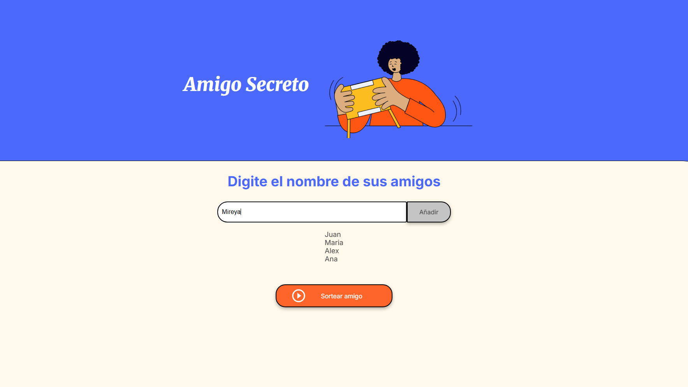
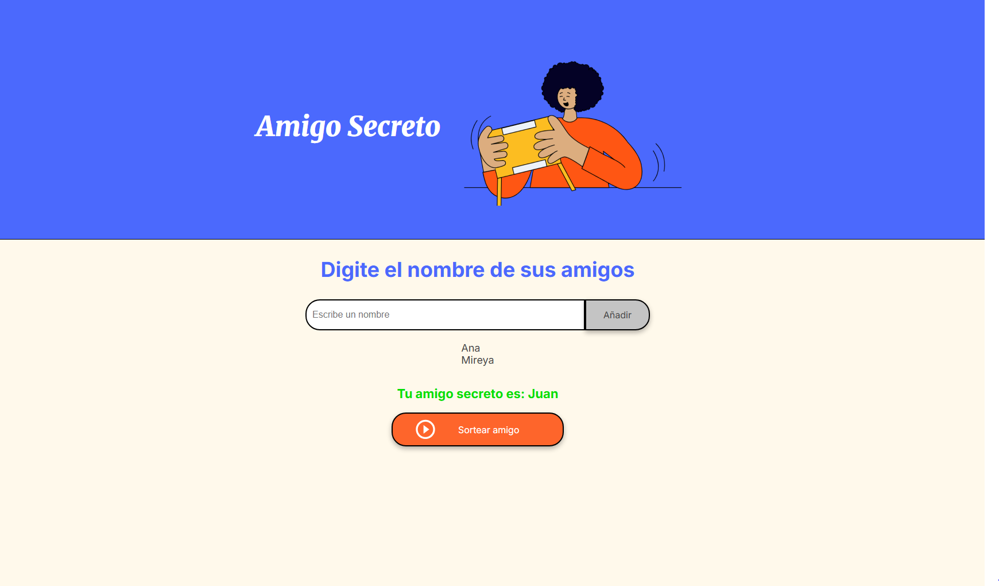

# Challenge Alura Latam - Amigo Secreto

Es un proyecto desarrollado en Java Script, CSS y HTML, donde se puede hacer un sorteo de nombres aleatoreamente ingresando una lista de nombres. 

## Demo

[Challenge](https://essacx.github.io/challenge-amigo-secreto-aluraLatam/)

## Screenshots

## Features

- Permite sortear un amigo al azar.
- El codigo nos deja usar "enter" facilitando la entrada de nombres.
- El nombre ya orteado no se repetira, es eliminado de la lista.
- No funcionara si los campos estan vacios.

## Tech Stack

Java Script, CSS y HTML

